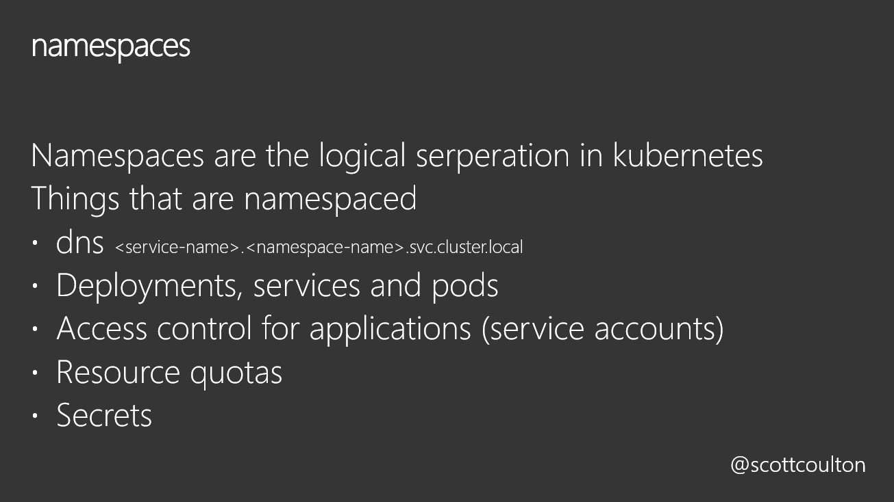
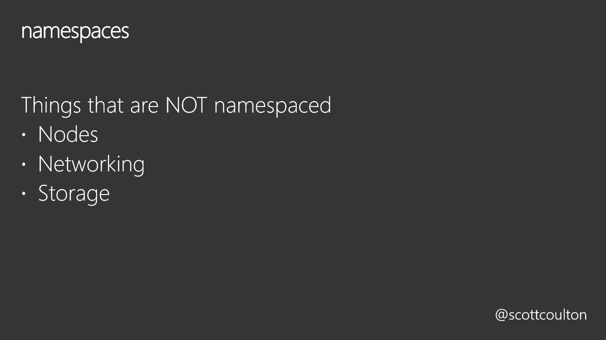
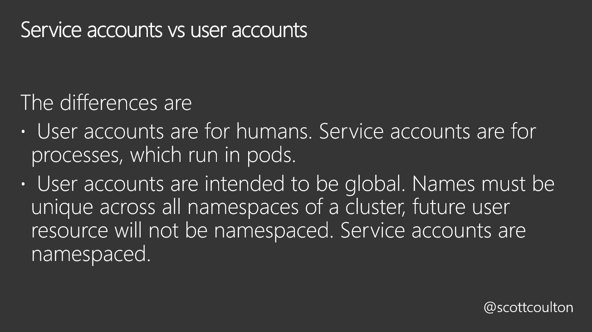

# Rbac roles and service accounts






## Namespaces

Lets look at the default namespaces available to us.  
We do this by issuing `kubectl get namespaces`
In the last lab we deployed our deployment to the default namespace as we did not define anything.
Kubernetes will place any pods in the default namespace unless another one is specified.

For the next part of the lab we will create a namespace to use for the rest of the lab. We will do that by issuing  
```
cat <<EOF | kubectl apply -f -
apiVersion: v1
kind: Namespace
metadata:
  name: webapp-namespace
EOF
```

Then if we check our namespaces again via `kubectl get namespaces` if we were successful then we should see the new namespace.

## Cluster roles, Service accounts and Role bindings

Now we have our namespace set up we are going to create a service account and give it full access to that namespace only.

We are now going to create a service account for the namespace that we created earlier.

```
cat <<EOF | kubectl apply -f -
apiVersion: v1
kind: ServiceAccount
metadata:
  name: webapp-service-account
  namespace: webapp-namespace
EOF
```
Then we will create a role giving us full permissions to the namespace

```
cat <<EOF | kubectl apply -f -
kind: Role
apiVersion: rbac.authorization.k8s.io/v1
metadata:
  name: webapp-role
  namespace: webapp-namespace
rules:
  - apiGroups: [""]
    resources: ["pods", "pods/log"]
    verbs: ["get", "list", "watch"]
EOF
```
Then we will create a role binding to tie it all together

```
cat <<EOF | kubectl apply -f -
kind: RoleBinding
apiVersion: rbac.authorization.k8s.io/v1
metadata:
  name: webapp-role-binding
  namespace: webapp-namespace
subjects:
  - kind: ServiceAccount
    name: webapp-service-account
    namespace: webapp-namespace
roleRef:
  kind: Role
  name: webapp-role
  apiGroup: rbac.authorization.k8s.io
EOF
```

Now lets deploy our application into our new namespace.

```
cat <<EOF | kubectl apply -f -
apiVersion: apps/v1 # for versions before 1.9.0 use apps/v1beta2
kind: Deployment
metadata:
  name: webapp-deployment
  namespace: webapp-namespace
spec:
  selector:
    matchLabels:
      app: webapp
  replicas: 1
  template:
    metadata:
      labels:
        app: webapp
    spec:
      containers:
      - name: webapp
        image: scottyc/webapp:latest
        ports:
        - containerPort: 3000
          hostPort: 3000
EOF
```

Then we can check our pods simulating the privileges of the service-account we will set up our kubeconfig to only use our service account
We will first get the secret for that service account  
`SECRET_NAME=$(kubectl get sa webapp-service-account --namespace webapp-namespace -o json | jq -r .secrets[].name)`  

Then create a ca certificate 
`kubectl get secret --namespace webapp-namespace "${SECRET_NAME}" -o json | jq -r '.data["ca.crt"]' | base64 --decode > ca.crt`

Then get the user token from our secret
`USER_TOKEN=$(kubectl get secret --namespace webapp-namespace "${SECRET_NAME}" -o json | jq -r '.data["token"]' | base64 --decode)`

Now will will setup our kubeconfig file
```
context=$(kubectl config current-context)
CLUSTER_NAME=$(kubectl config get-contexts "$context" | awk '{print $3}' | tail -n 1)
ENDPOINT=$(kubectl config view -o jsonpath="{.clusters[?(@.name == \"${CLUSTER_NAME}\")].cluster.server}")
kubectl config set-cluster "${CLUSTER_NAME}" --kubeconfig=admin.conf --server="${ENDPOINT}" --certificate-authority=ca.crt --embed-certs=true
kubectl config set-credentials "webapp-service-account-webapp-namespace-${CLUSTER_NAME}" --kubeconfig=admin.conf --token="${USER_TOKEN}"
kubectl config set-context "webapp-service-account-webapp-namespace-${CLUSTER_NAME}" --kubeconfig=admin.conf --cluster="${CLUSTER_NAME}" --user="webapp-service-account-webapp-namespace-${CLUSTER_NAME}" --namespace webapp-namespace
kubectl config use-context "webapp-service-account-webapp-namespace-${CLUSTER_NAME}" --kubeconfig="${KUBECFG_FILE_NAME}"
```
note if you want to cheat there is a shell script [here](script.sh)

We will then load the file in our terminal
`export KUBECONFIG=admin.conf`

Now let's check our permissions by seeing if we can list pods in the default namespace
`kubectl get pods`

Now let's check our namespace
`kubectl get pods --namespace=webapp-namespace`

(Check [here](https://kubernetes.io/docs/reference/access-authn-authz/rbac/#referring-to-subjects) for more info about rbac subjects)

Now we have limited the blast radius of our application to only the namespace that it resides in. 
So there will be no way that we can leak configmaps or secrets from other applications that are not in this namespace.

Lastly and this is super IMPORTANT !!!! run the cleanup script before you move to the next module  
`./cleanup.sh`

Now we move onto the next module [here](../statefull-sets/code.md)