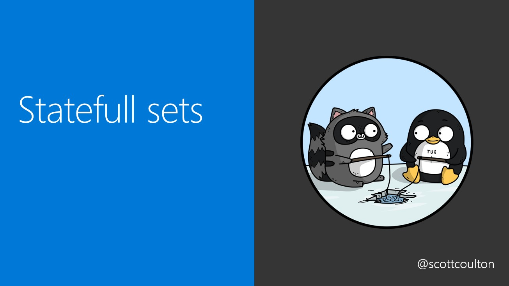
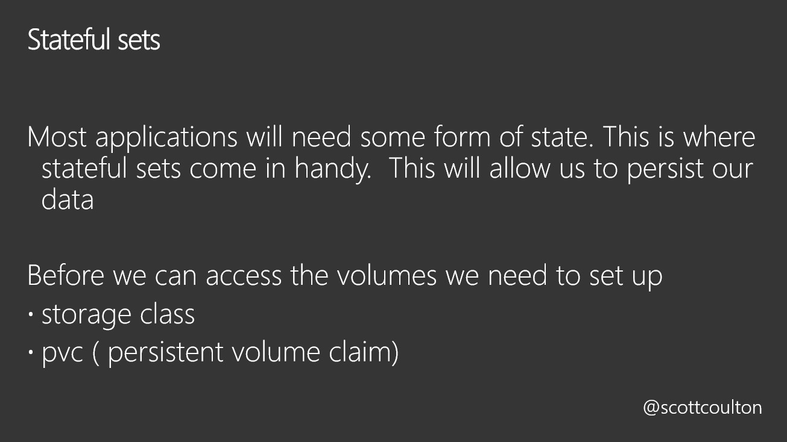
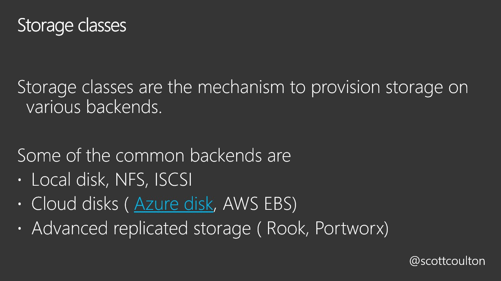
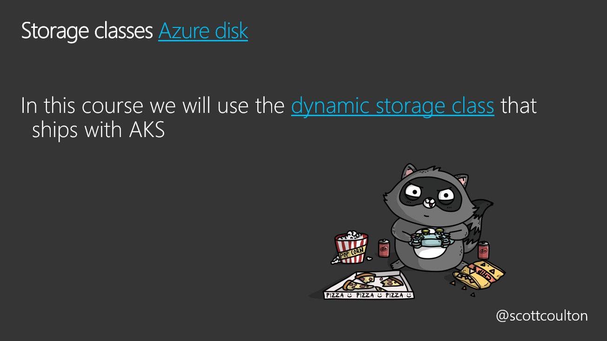

# Static claims






In this module we are going to look at creating a stateful set in Kubernetes.  
Stateful sets in Kubernetes attach a cloud disk to a pod. In this case we are using Azure disk.  

Azure ships with two disk types for stateful sets out of the box. You can see these by issuing the command  
`kubectl get sc`

The next thing we need to do is create a pvc (persistent volume claim)

## Creating a static claim
```
cat <<EOF | kubectl apply -f -
apiVersion: v1
kind: PersistentVolumeClaim
metadata:
  name: aks-volume-claim
spec:
  accessModes:
    - ReadWriteOnce
  resources:
    requests:
      storage: 10Gi
EOF
```

Once the pvc is created we can bind a pod to use it  
Below we are going to mount a volume to the pod `/usr/share/nginx/html`

## Using the claim
```
cat <<EOF | kubectl apply -f -
kind: Pod
apiVersion: v1
metadata:
  name: nginx-pvc
spec:
  volumes:
    - name: nginx-storage
      persistentVolumeClaim:
       claimName: aks-volume-claim
  containers:
    - name: task-pv-container
      image: nginx
      ports:
        - containerPort: 80
          name: "http-server"
      volumeMounts:
        - mountPath: "/usr/share/nginx/html"
          name: nginx-storage
EOF
```
Now we move onto the next module [here](../ingress-controller/code.md)